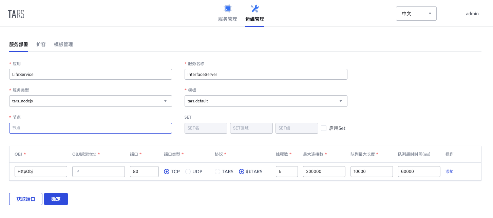

# InterfaceServer

This service is the proxy layer of miniprogram LifeService's backend, which is the 

For server interface, see [API Document](docs/API.md)。

## Structure

```sh
InterfaceServer
├── app.js                       # main file
├── README.md
├── README_en.md
├── docs                         # Document resource
├── config                       # config files
│   └── appConf.js
├── package.json
├── proxy                        # tars files proxy files
│   ├── DataService.tars
│   ├── ServerStatus.tars
│   ├── UserInfoService.tars
│   ├── ClubActivityManager.tars
│   └── MessageWall.tars
├── router                       # router files
│   ├── index.js
│   └── routerConf.js            # router config
├── servers                      # servers interface implement
│   ├── UserInfoServer.js
│   ├── ClubActivityServer.js
│   ├── MessageWallServer.js
│   ├── UserInfoServer.js
│   └── WeixinAPI.js
└── tools                        # tools
    └── util.js
```

## Development Environment
- `Node.js` >= 0.10
- `tars-deploy`, TarsNode.js package tool. For installation and user guide, see[tarsnode/deploy](https://github.com/tars-node/deploy/tree/master)

## Build

Clone this project and configure the cert and key path in file `config/appConf.js`

Get into the path proxy, use tars protocol files to generate proxy js code

```sh
cd proxy
/usr/local/tars/cpp/tools/tars2node DataService.tars
/usr/local/tars/cpp/tools/tars2node ServerStatus.tars
/usr/local/tars/cpp/tools/tars2node UserInfoService.tars --client # generate tars proxy code for client
/usr/local/tars/cpp/tools/tars2node ClubActivityManager.tars --client
/usr/local/tars/cpp/tools/tars2node MessageWall.tars --client
cd -
```

Execute the following command to install the dependences.

```sh
npm install
```

Use command `tars-deploy` to pack the public package

```
tars-deploy InterfaceServer
```

## Server Deployment

### Deployment Configuration

Go to `TarsWeb->Operation->Deploy service`, and deploy the service according to the following configuration.

* Service info：
    * APP: `LifeService`
    * Service name: `InterfaceServer`
    * Service type: `tars_nodejs`
    * Template: `tars.nodejs.default`
* Obj info：
    * OBJ: `HttpObj`
    * Protocol: not TARS
    * Port: `80` (Miniprogram requires the port must be `80`)



### Publish Service

Go to `TarsWeb->Services->LifeService->InterfaceServer->Publish`, and

* Choose the node which you just deploy and click `publish node`.
* click `upload release package` and choose the package you just built to upload.
* Select the version you just uploaded in the `release version` list.
* Click `publish` and finish.